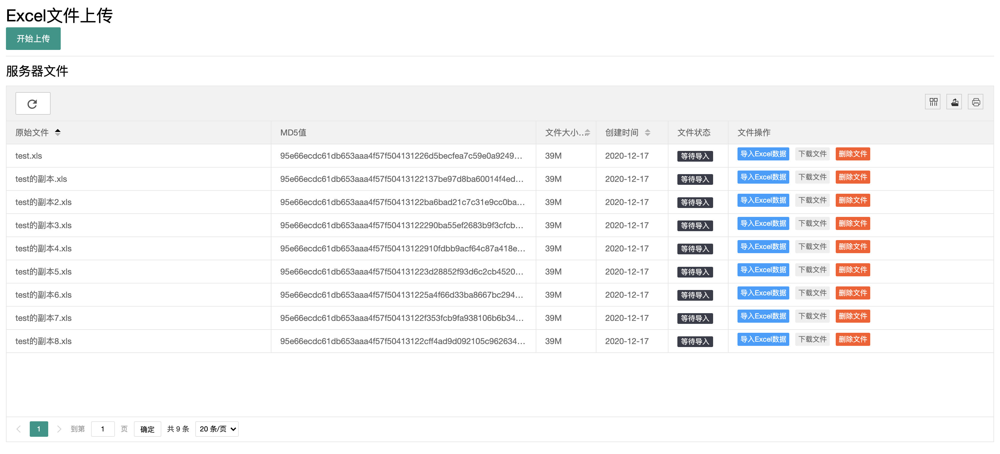
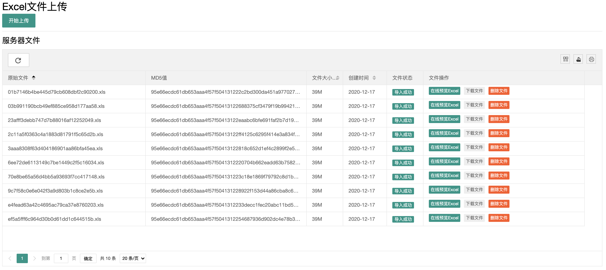
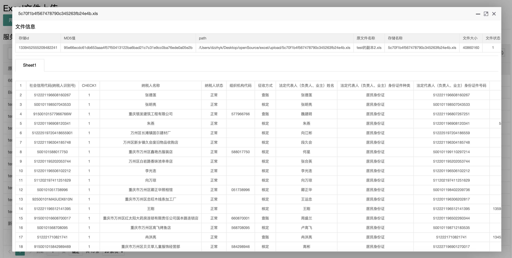

# excel-upload

Excel大文件上传存储示例项目

## 前端

Layui + WebUploader

- 多文件上传队列
- 分块、异步、多线程上传
- 上传进度条、文件状态
- 服务器文件列表和操作
- Excel文件在线预览

## 后端

SpringBoot + MongoDB + Mybatis-plus + JPA + Mysql

- MD5值由文件+文件名计算得到
- 流式读取excel，减小内存压力
- 多线程多个excel同时导入MongoDB
- 分页查询

## 使用

1. 下载项目
2. 配置Mysql
3. 配置MongoDB
4. 访问localhost:8080

## 运行截图

## 性能

简单测试

使用docker部署MongoDB，2核4G

- 插入性能

| 总条数  | 文件总大小 | 写入耗时 |
| ------- | -------- | ------------ |
| 42276   | 39M      | 11.2s        |
| 1048576 | 69M      | 96.6s        |
| 42276 * 10并发 | 39M * 10      | 33s |

- 查询性能

| 条数 | 查询耗时 |
| ---- | ------------ |
| 100W | 4ms ~ 30ms   |
| 4W * 10并发 |  5ms ~  |